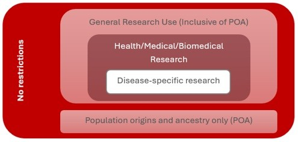
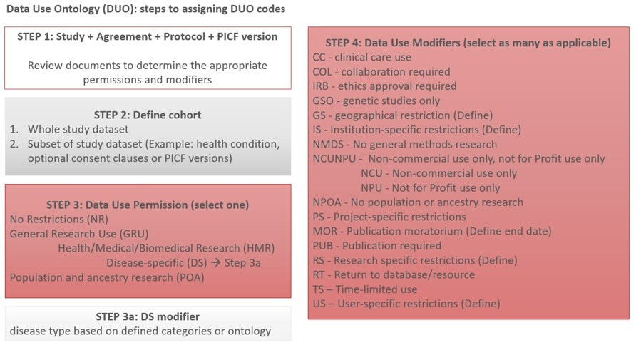
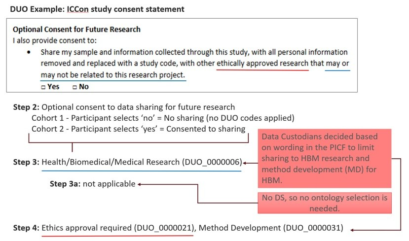

# Application of Data Use Ontology (DUO) codes to datasets: QIMR Berghofer Data Commons use case

## Background

The Data Use Ontology (DUO) was developed by the Global Alliance for Genomics and Health (GA4GH) Data Use and Identities Work Stream [[1]](#1)[[2]](#2).  DUO is an ontology for coding genomics data from health and medical research for data sharing permissions and restrictions.

Permissions and restrictions for genomic data sharing are often found in complex documents, such as participant information and consent forms (PICF) and research agreements. They can also be assigned based on organisational policies or executive expectations. Tagging data with DUO codes enables data sharing permissions to be clearly articulated and presented in a computer-readable format. This benefits the internal operations of data commons, and when uploading dataset metadata to public platforms, such as the European Genome-phenome Archive [[3]](#3).

The DUO hierarchy of codes consists of 35 codes within three classes – data use permission, data use modifiers and investigations.

QIMR Berghofer Genomic Data Commons is the custodian of over 20 omics datasets from research projects. Each project has its own data sharing requirements defined by the PICF that the participants signed, research agreements with the collaborators or their organisation and our institutional policies. As a result, there are various permissions and restrictions on data reuse for the datasets in our custodianship.

QIMR Berghofer’s Genomic Data Commons (‘Data Commons’) is the infrastructure and associated data governance process for sharing genomics datasets for secondary research purposes. The Data Commons governance processes are based on GA4GH’s consent and data management recommendations - Data Use Ontology (DUO) [[1]](#1) and Framework for Responsible Sharing of Genomics and Health-Related Data [[4]](#4).  These concepts underpin the Data Commons’s principles for data sharing and consent.

Despite this guidance and structure, internal processes still need to be defined for the application and implementation of data sharing. This ensures participants’ consent is respected and that there is the consistent application of data sharing and data curation. This is particularly relevant for complex issues prone to contention and varying perspectives.  

## Scope

This document outlines the process Data Commons custodians use to interpret participant consent options in PICF into DUO codes. The aim is to support consistency in decision-making and data curation.

The scope of this document **does not** cover expectations for QIMR Berghofer Genomics Data Commons Data Access Committee (DAC) decision-making for the approval of data access requests.

## Objective

To summarise DUO codes and define how they are applied in the Data Commons.

## Data Use Ontology (DUO)
### Data Use Permission

The data use permission codes articulate data use and are the core of the DUO system. They are a hierarchical set of interrelated codes (Figure 1). Only one of these codes is applied to every dataset to define the data use parameters (Table 1). When a dataset lacks any code from the data use permissions options, this is an indicator that data sharing is not allowed.  

*Figure 1: Diagram representing the hierarchical and interrelated nature of the data use permission codes.*

General Research Use (GRU), Health and Medical and Biomedical research (HMB) and Disease-specific research (DS) are the most commonly used codes for datasets that are generated from health and medical research. It is important to note that by applying data use modifiers (see next section), further restrictions or permissions can be applied to these data use permission codes.

Population origins and ancestry only (POA) are separated in both Data Use Permission and Data Use Modifiers, as they are the most contentious use cases for genomics datasets. Allowing data for population origins and ancestry research needs to be weighed against the viewpoints of the communities that can be affected by secondary study. It is possible to remove POA from GRU by applying the data use modifier - Population origins or ancestry research prohibited (DUO_0000044).

*Table 1: Data Use Permission codes* [[5]](#5)

| Name | Definitions | Abbreviation | DUO Code |
| --- | --- | --- | --- |
| Data Use Permission | A data item is used to indicate consent permissions for datasets and/or materials, and relates to the purposes for which datasets and/or material might be removed, stored or used. | - | DUO_0000001 |
| General Research Use | This data use permission indicates that use is allowed for general research use for any research purpose. (This includes but is not limited to: health/medical/biomedical purposes, fundamental biology research, the study of population origins or ancestry, statistical methods and algorithms development, and social-sciences research.) | GRU | DUO_0000042 |
| -> Health or Medical or biomedical research | This data use permission indicates that use is allowed for health/medical/ biomedical purposes; does not include the study of population origins or ancestry. | HMB | DUO_0000006 |
| -> Disease specific research | This data use permission indicates that use is allowed provided it is related to the specified disease. (This term should be coupled with a term describing a disease from an ontology to specify the disease the restriction applies to.) | DS | DUO_0000007 |
| Population origins or ancestry research only | This data use permission indicates that use of the data is limited to the study of population origins or ancestry. | POA | DUO_0000011 |
| No restrictions | This data use permission indicates there is no restriction on use. | NR | DUO_0000004 |
-> Denotes a subclass of the previous code

### Data Use Modifiers

There are 18 Data Use Modifiers within DUO (Table 2). Multiple data use modifiers can be applied to a dataset. The selection and use of data use modifiers is based on what is: 
* communicated in participant consent documents, and
* considered acceptable or required by researchers who lead the study, data custodians or the organisation responsible for the data.

Most common data use modifiers encountered in PICFs relate to ethical approval required (DUO_0000021), geographical restrictions (DUO_0000022) and the codes for restricting use in commercial or for-profit situations (DUO_0000018, 45 & 46).
The codes requested by the original researchers, data custodian or organisational requirements relate to how data is managed and results communicated. For example, publication moratorium (DUO_0000024), time limits on use (DUO_0000025), and requirements of collaboration (DUO_0000020).
Some data use modifier codes will be coupled with values that qualify the modifier. For example, the time limit on use (DUO_0000022) would be associated with the number of months that data can be used (Table 2). There needs to be consideration of how these values are determined and implemented when DUO codes are used in tags and scripts, as this is defined by the implementer of DUO, not the DUO system itself.

*Table 2: Data Use Modifier codes* [[5]](#5)

| Name | Definitions | Qualifiers | Code |
| ---- | --- | --- | --- |
| Data Use Modifier | Data use modifiers indicate additional conditions for use. | | DUO_0000017 |
| Clinical Care Use | This data use modifier indicates that use is allowed for clinical use and care. Data may be used for clinical decision making. | | DUO_0000043 |
| Collaboration required | This data use modifier indicates that the requestor must agree to collaboration with the primary study investigator(s). | Primary study investigator(s). | DUO_0000020 |
| Ethics Approval required | This data use modifier indicates that the requestor must provide documentation of local ethics approval. | | DUO_0000021 |
| Genetic studies only | This data use modifier indicates that use is limited to genetic studies only (i.e., studies that include genotype research alone or both genotype and phenotype research, but not phenotype research exclusively) | | DUO_0000016 |
| Geographical restrictions | This data use modifier indicates that use is limited to within a specific geographic region. | Ontology term describing the allowed geographical location(s) | DUO_0000022 |
| Institution specific restrictions | This data use modifier indicates that use is limited to use within an approved institution. | | DUO_0000028 |
| No general methods research | This data use modifier indicates that use does not allow methods development research (e.g., development of software or algorithms). | | DUO_0000015 |
| -> Not for profit, non commercial use only | This data use modifier indicates that use of the data is limited to not-for-profit organisations and not-for-profit use, non-commercial use. | | DUO_0000018 |
| -> Non commercial use only | This data use modifier indicates that use of the data is limited to not-for-profit use. This indicates that data can be used by commercial organisations for research purposes, but not commercial purposes. | | DUO_0000046 |
| Not for profit organisations use only | This data use modifier indicates that use of the data is limited to not-for-profit organisations. | | DUO_0000045 |
| Population origins or ancestry research prohibited | This data use modifier indicates use for purposes of population, origin, or ancestry research is prohibited. | | DUO_0000044 |
| Project specific restriction | This data use modifier indicates that use is limited to use within an approved project. | | DUO_0000027 |
| Publication moratorium | This data use modifier indicates that requestor agrees not to publish results of studies until a specific date. | Date specified as ISO8601. | DUO_0000024 |
| Publication required | This data use modifier indicates that requestor agrees to make results of studies using the data available to the larger scientific community. | | DUO_0000019 |
| Research specific restrictions | This data use modifier indicates that use is limited to studies of a certain research type. | Research types allowed | DUO_0000012 |
| Return to database or resource | This data use modifier indicates that the requestor must return derived/enriched data to the database/resource. | | DUO_0000019 |
| Time limited use | This data use modifier indicates that use is approved for a specific number of months. | Value indicating the number of months. | DUO_0000025 |
| User specific restriction | This data use modifier indicates that use is limited to use by approved users. | | DUO_0000026 |
-> Denotes a subclass of the previous code

### Investigations

There are 10 investigation codes in the DUO code system. These placeholder codes are intended to allow compatibility with the Ontology of Biomedical Investigations (OBI) [[6]](#6).  These are not generally used by the platforms that have implemented DUO and are not being implemented by the Data Commons.

## QIMR Berghofer’s application of DUO
### Process for applying DUO codes

The following process is applied to determine which DUO codes should be used to a dataset. This process is summarised in Figure 2.

**Determine participant consent to data sharing:**

* Review all versions of consent forms for a research project to determine if DUO codes can be consistently applied to the cohort. This is to identify if: 
  1. Opt-in data sharing consent clauses were used, and 
  2. During a project, there were modifications to consent forms that changed the data sharing conditions or applicable DUO codes.

**Define the dataset or data sub-sets:**

* When consistent data sharing language is present across consent forms, the cohort can have the same DUO codes and form a single dataset.
* When data sharing language in consent forms changes the DUO codes applied to a dataset, there are two options:
  1. Create data subsets based on the consent form version signed by participants and apply the appropriate DUO codes to the subsets.
  2. Create a single dataset of participants and apply the DUO codes with the most restrictive data sharing options.^
 
^The latter option still has ethical issues since the consent preferences of those who provided greater consent to data sharing are not being fulfilled. However, when there are barriers that limit the division of a dataset, this is the pragmatic solution. Conversely, the data custodians cannot unilaterally increase the consent level/permissiveness of the DUO codes applied to the dataset if they are counter to the permission the participant gave. The HREC that approved the project might permit increasing consent level/permissiveness, but this is untested at this time. 

**Determine the data sharing requirements of the primary researchers, data custodians or host organisation:**

* Not all aspects of data sharing are disclosed to participants when they consent to the future use of their data. The Data Custodian determines the allowable scope of data sharing or when other parties need to be consulted (i.e. HREC, community & consumers) without specific statements of consent from the participant.
* Consider the scope of data use that the organisation or data custodian is comfortable approving. This is not written into consent but might reflect legal considerations, risk appetite or societal expectations. This will likely change over time, so it should be reviewed semi-regularly. For example, ancestry research that involves particular groups or research by commercial entities.
* If housing data on behalf of primary researchers, consult on restrictions and allowances for use. This may include reviewing research agreements related to the original project or data transfer agreements for housing data. This might change over time, so it should be reviewed or have limits placed on expectations, like a moratorium on publication.

Once these aspects have been appropriately considered, the DUO codes can be selected and applied to a dataset. Figure 3 shows an example of the application of DUO to the Australian Genomics ICCon study dataset.

*Figure 2: Stepwise description for the application of DUO codes.*

*Figure 3: Example of the application of DUO Codes using Australian Genomics’ ICCon study.*

## QIMR Berghofer's usage of DUO in the Data Commons datasets

DUO codes are applied per dataset, not per participant, as the Data Commons does not facilitate per participant sharing.
All datasets are coded with one data use permission code of either GRU (DUO_0000042), HMB (DUO_0000006) or DS (DUO_0000007). For studies that only allow DS, the Mondo ontology defines biomedical terms for the allowable conditions (See the Ontology Report).
Data Use Modifiers are applied to data sets per the PICF and collaborators' requirements.
All datasets have the following Data Use Modifiers applied based on Data Custodians and Institutional requirements:
* Time limit on use (DUO_0000025) – with time limit defined in Data Transfer Agreement (DTA) schedule
* Population origins or ancestry research is prohibited (DUO_0000044)
* Ethical approval required (DUO_0000021)

## Other considerations
### Aggregated data release

Unless otherwise stated in the PICF, consent to data sharing is related to individual-level de-identified data. As such, aggregated data for studies can be made publicly available in search platforms, such as BEACON.

When there are statements in PICF that limit the sharing of aggregated data, then DUO codes can be applied to define those limitations.

Anonymised data does not include individual-level genomic or associated health data, even where the participant’s identifiers have been removed. Consideration must also be given on a case-by-case basis to aggregated datasets with few participants or rare variants that could result in identifiable aggregated data.

### Publicly accessible data
When data in the Data Commons has participant permission to be publicly available, the DUO codes that would be applied are: no restrictions (DUO_0000004) with no data use modifiers.

### No data sharing
When data sharing is not allowed due to no participant consent to sharing for future research, there is no associated DUO code. However, the absence of codified data can create issues for creating scripts and database tagging. As such, QIMR Berghofer Bioinformaticians enter DUO_xxxxxxx to datasets or samples that cannot be shared.

## References

<a id="1">[1]</a> Global Alliance for Genomics and Health (2021) Data Use Ontology. https://www.ga4gh.org/product/data-use-ontology-duo/

<a id="2">[2]</a> Lawson, J., et al. (2021) The Data Use Ontology to streamline responsible access to human biomedical datasets. Cell Genomics. 1:2, 100028.

<a id="3">[3]</a> European Genome-phenome Archive (2025) Data Use Ontology at EGA. https://ega-archive.org/access/data-access-committee/data-use-ontology/

<a id="4">[4]</a> Global Alliance for Genomics and Health (2019) Framework for responsible sharing of genomic and health-related data. https://www.ga4gh.org/product/framework-for-responsible-sharing-of-genomic-and-health-related-data/

<a id="5">[5]</a> https://www.ebi.ac.uk/ols4/ontologies/duo

<a id="6">[6]</a> Bandrowski, A., et al. (2016) The Ontology for Biomedical Investigations. PloS One. 11(4):e0154556. (https://obi-ontology.org/)
